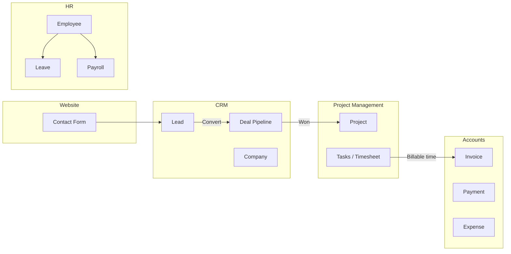

# PixelsSoft Admin — User Guide

Admin panel URL (local): `http://127.0.0.1:8000/admin`  
Default login: `admin@pixelssoft.com` / `password`

---

## Platform Overview



---

## Module Flows

### 1. CRM (Sales)

| Step | Action | Where |
|------|--------|-------|
| 1 | Website visitor submits contact form | Public website |
| 2 | System auto-creates Lead + Company + Contact | CRM → Leads |
| 3 | Sales rep qualifies lead | Lead detail page |
| 4 | Convert lead to deal | Lead → **Convert to Deal** |
| 5 | Move deal through pipeline | CRM → Deal Pipeline (kanban) |
| 6 | Mark deal **Won** | Drag to Won stage → auto-creates PM project |
| 7 | View analytics | CRM → CRM Reports |

**Sales rep note:** Reps only see leads/deals they own (`owner_id`).

---

### 2. Project Management (PM)

| Step | Action | Where |
|------|--------|-------|
| 1 | Project created (manually or from won deal) | PM → Projects |
| 2 | Add tasks on kanban board | Project → Task Board |
| 3 | Log time on timesheet | PM → Timesheet |
| 4 | Manager approves billable entries | Timesheet → Approve |
| 5 | Track milestones & budget burn | Project detail page |
| 6 | View utilization reports | PM → PM Reports |

---

### 3. Accounts (Finance)

| Step | Action | Where |
|------|--------|-------|
| 1 | Create invoice manually | Accounts → Invoices → New |
| 2 | Or generate from approved time | Finance Dashboard → **Create Invoice from Time** |
| 3 | Download PDF / mark as sent | Invoice detail page |
| 4 | Record payment | Invoice detail → Add Payment |
| 5 | Employees submit expenses | Accounts → Expenses |
| 6 | Finance approves expenses | Expenses → Approve |
| 7 | View P&L & aging | Accounts → Finance Reports |

---

### 4. Human Resources (HR)

| Step | Action | Where |
|------|--------|-------|
| 1 | Create employee (links to user optional) | HR → Employees |
| 2 | Leave balances auto-initialized | On employee create |
| 3 | Employee requests leave | HR → Leave |
| 4 | HR approves → balance deducted | Leave → Approve |
| 5 | Upload contracts/IDs | HR → Documents |
| 6 | Run monthly payroll | HR → Payroll → Create Run → Process |
| 7 | Download payslip PDF | Payroll run → Payslip link |
| 8 | Manage departments | HR → Departments |
| 9 | Headcount & attendance reports | HR → HR Reports |

---

### 5. Content (CMS)

Manage blogs, portfolio, showcase, services, page sections, and media library. Published content syncs to the static Next.js frontend after export/deploy.

---

### 6. System

| Feature | Path |
|---------|------|
| Users | System → Users |
| Roles & permissions | System → Roles |
| Invite users | System → Invitations |
| Audit trail + CSV export | System → Activity Log |
| Profile | Top bar → Profile |

---

## How to Create a New Role

1. Log in as **Super Admin** (or any user with `system.roles.edit`).
2. Go to **System → Roles**.
3. Click **+ New Role**.
4. Enter a role name in lowercase with hyphens (e.g. `account-manager`).
5. Check the permissions this role should have (grouped by module).
6. Click **Create Role**.
7. Assign the role to a user:
   - **System → Users → Edit user** → select role, or
   - **System → Invitations** → invite with that role.

### Edit an existing role

1. **System → Roles** → **Edit Permissions** on any role.
2. Toggle checkboxes and save.
3. **Super Admin** cannot be modified (always has all permissions).

### Built-in roles (from seeder)

| Role | Purpose |
|------|---------|
| `super-admin` | Full access |
| `content-editor` | CMS only |
| `sales-manager` | CRM + read PM/accounts |
| `sales-rep` | Own leads/deals only |
| `project-manager` | PM + limited CRM/accounts |
| `finance` | Accounts module |
| `hr-admin` | HR module |
| `employee` | Self-service: tasks, time, leave, expenses |

---

## Sidebar Scrollbar

The sidebar scrolls when there are many menu items (CRM, PM, Accounts, HR, CMS, System). The scrollbar is **hidden visually** but you can still scroll with mouse wheel or touch — this keeps the dark sidebar clean.

---

## Branding

The admin uses the same **PixelsSoft logo** as the public website (`/img/pixels-soft-logo.png`) in the sidebar header.

---

## Local Development

```bash
# Backend (from pixelssoft-admin/)
php artisan serve          # http://127.0.0.1:8000

# Frontend (from project root)
yarn dev                   # http://localhost:3000
```

### Useful commands

```bash
php artisan migrate --force
php artisan db:seed --class=RolesAndPermissionsSeeder --force
php artisan db:seed --class=MigrateContactMessagesToLeadsSeeder --force
php artisan test --filter=AdminSmokeTest
```

---

## Page Checklist (Smoke Test)

Run `php artisan test --filter=AdminSmokeTest` to verify all main GET pages return HTTP 200 for the super-admin user.

| Module | Pages tested |
|--------|----------------|
| Overview | Dashboard |
| CRM | Dashboard, Leads, Deals Kanban, Companies, Contacts, Reports |
| PM | Dashboard, Projects, Timesheet, Reports |
| Accounts | Dashboard, Invoices, Payments, Expenses, Reports |
| HR | Dashboard, Employees, Leave, Attendance, Payroll, Documents, Departments, Reports |
| CMS | Blogs, Portfolio, Showcase, Services, Sections, Media, Messages |
| System | Users, Roles, Invitations, Activity Log, Settings |

---

## Deployment

See [DEPLOYMENT.md](../DEPLOYMENT.md) in the project root for production setup (MySQL, static export, API URL).
